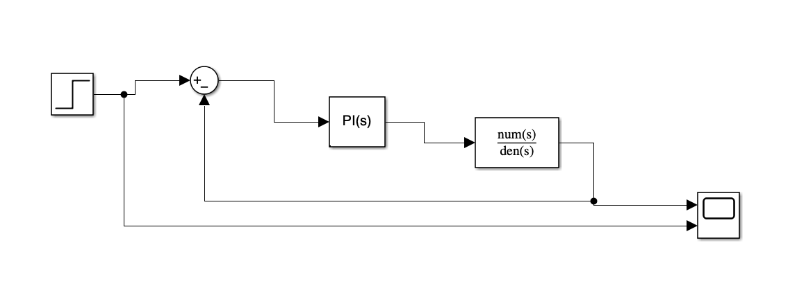
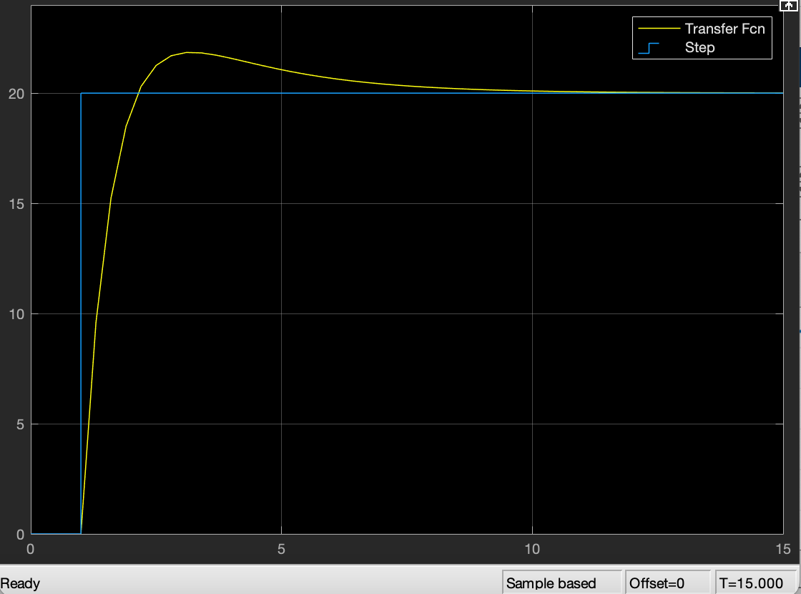
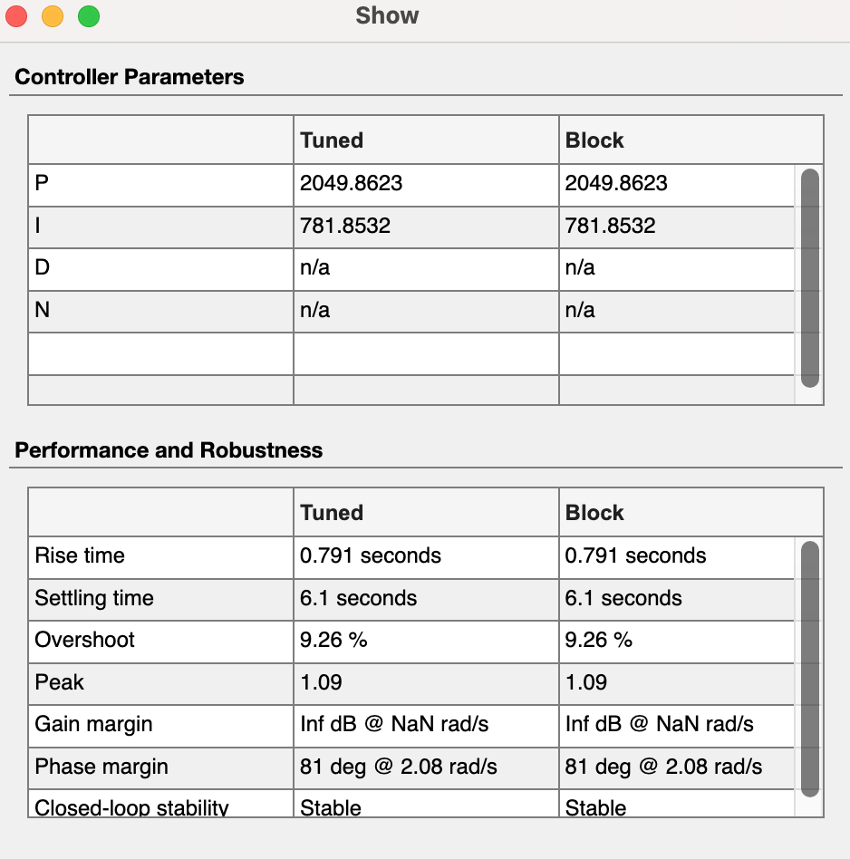
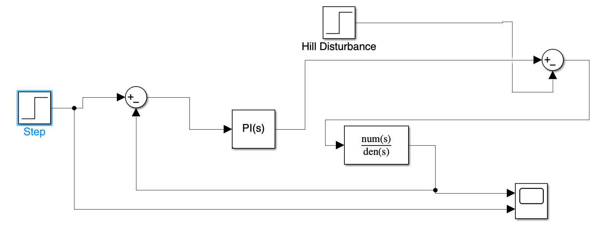
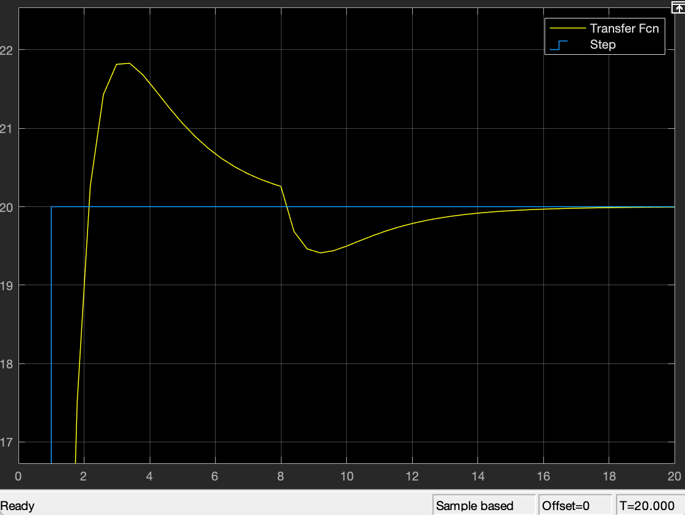

# Cruise Control PI Controller

## Project Objective

This project models a vehicle cruise-control system using Simulink.
A PI controller is used to track a target speed and reject an external
disturbance representing an uphill road load.

## Controller

- Controller type: PI
- Proportional gain (Kp): 1300
- Integral gain (Ki): 288

## Project A: Reference Tracking Test

- Target speed: 20 m/s
- Overshoot: approximately 7.5%
- Settling time: approximately 9.7 s
- Steady-state error: approximately 0

## Project B: Disturbance Rejection Test

An external disturbance was applied at 8 seconds to represent an
additional resistive force, such as a vehicle travelling uphill.

- Target speed: 20 m/s
- Disturbance time: 8 s
- Maximum initial speed: approximately 21.8 m/s
- Minimum speed after disturbance: approximately 19.5 m/s
- Final speed: approximately 20 m/s
- Final steady-state error: approximately 0

After the disturbance was applied, the vehicle speed decreased
temporarily. The PI controller responded to the resulting speed error
and returned the vehicle toward the target speed.

## Conclusion

The PI controller successfully tracks the target speed and rejects
a constant external disturbance. The integral action removes the
remaining steady-state error.